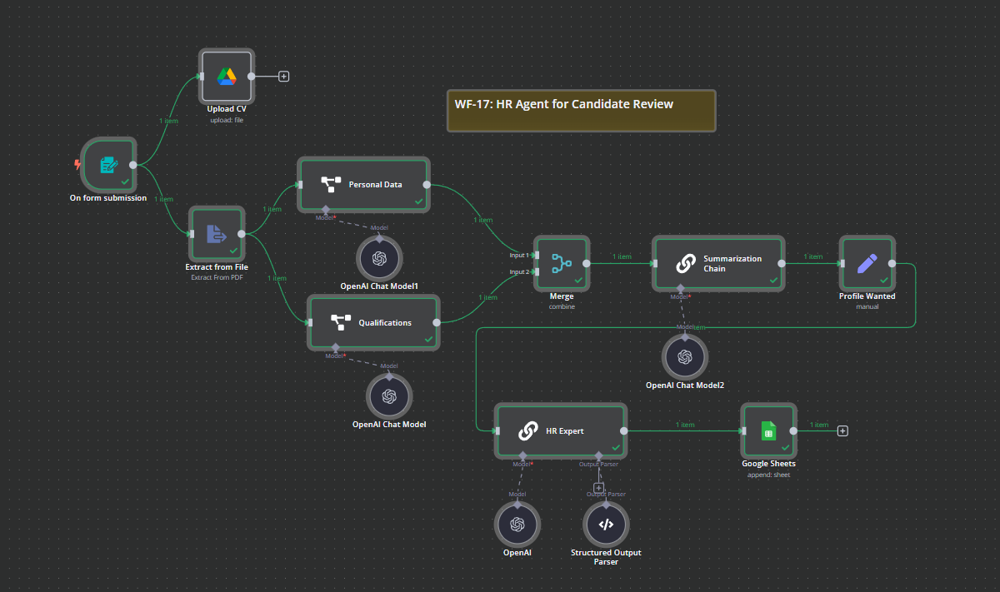

# WF-17: HR Agent for Candidate Review – n8n Workflow

## 📌 Overview
This **n8n workflow**, `WF-17: HR Agent for Candidate Review`, automates the **candidate screening process** by extracting key details from CVs, summarizing qualifications, and scoring candidates based on job requirements. The workflow then logs candidate details into Google Sheets for further review.

## 🔧 Workflow Components
### 🏗️ Core Modules
1. **📝 Form Trigger** – Captures candidate details (Name, Email, CV) via a submission form.
2. **📂 Google Drive Upload** – Stores uploaded CVs for record-keeping.
3. **📄 Extract from File** – Extracts text content from the submitted CV (PDF).
4. **📜 Personal Data Extractor** – Identifies key details like **city, birthdate, and contact number**.
5. **🎓 Qualifications Extractor** – Extracts **education, work experience, and skills** from the CV.
6. **📑 Summarization Chain** – Generates a **concise candidate profile summary**.
7. **🎯 Profile Matcher** – Compares the candidate’s profile against the **desired job role**.
8. **✅ HR Expert Evaluator** – Rates the candidate on a **scale of 1 to 10** based on alignment with the job role.
9. **📊 Google Sheets Storage** – Logs candidate details, summary, and HR evaluation score.

## ⚙️ How It Works
1. 📝 **A candidate submits a CV** through the form, triggering the workflow.
2. 📂 The **CV is uploaded** to Google Drive for record-keeping.
3. 📄 The **Extract from File** node processes the CV to extract text data.
4. 🎓 **AI Extractors** identify the candidate’s **education, work history, and skills**.
5. 📜 The **Summarization Chain** generates a concise **candidate profile**.
6. 🎯 The **Profile Matcher** compares the candidate’s profile against the **desired job role**.
7. ✅ The **HR Expert Evaluator** assigns a **rating (1-10)** and provides justification.
8. 📊 The **Google Sheets Storage** logs all relevant candidate details, including qualifications, skills, and HR evaluation.

## 📷 Workflow Screenshot

## 🚀 Setup Instructions
- 📥 **Import the workflow** into `n8n`.
- 🔑 **Ensure API credentials** for OpenAI, Google Drive, and Google Sheets are configured.
- ✅ **Activate the workflow** to start processing candidate applications.

## 📝 Notes
- ⚠️ The workflow is **inactive by default**.
- 🛠️ Modify job role criteria to align with **specific hiring needs**.
- 💡 Can be extended with **automated interview scheduling**.
